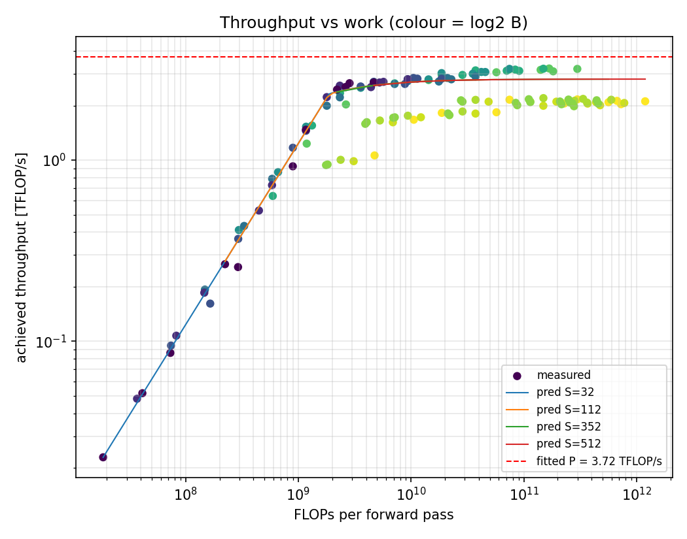
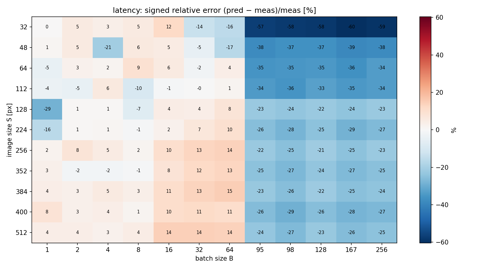
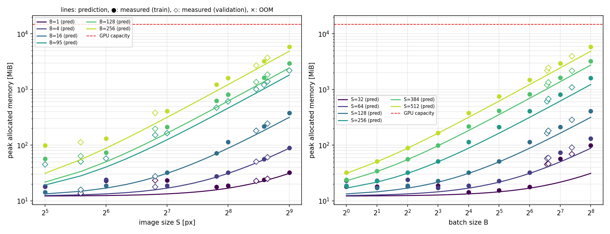
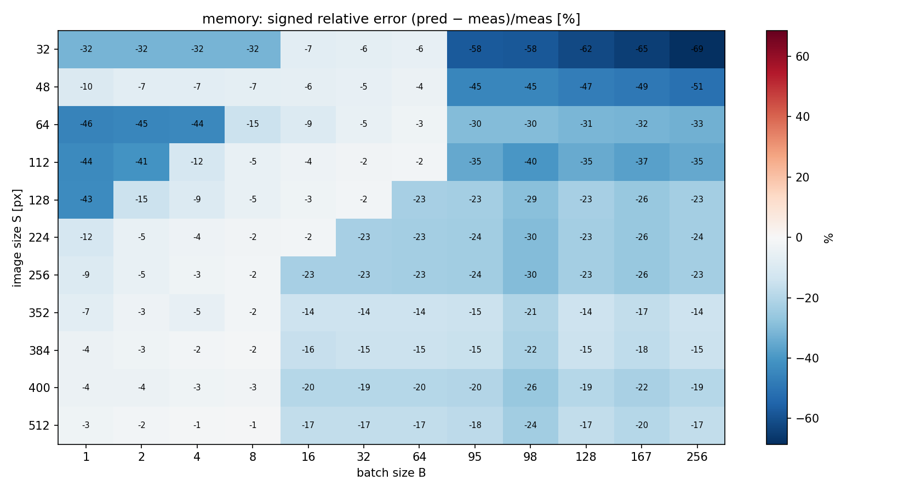
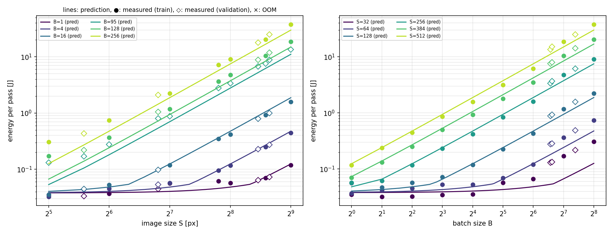
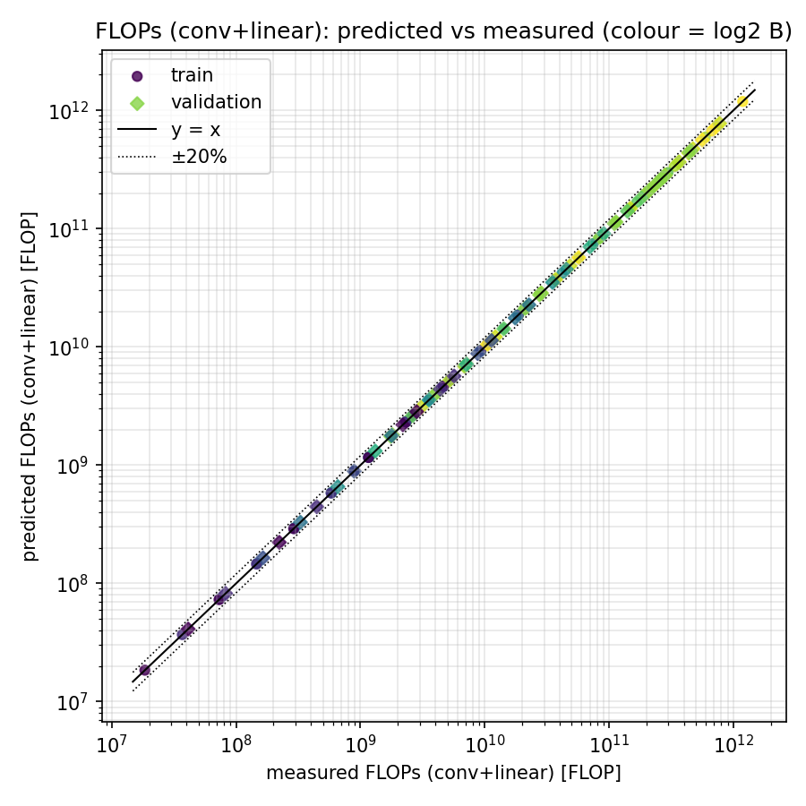

# HW1 — Analytical performance model of a small CNN

## Environment

| | |
|---|---|
| GPU | Tesla T4, 14.56 GiB, 40 SM (Google Colab) |
| Driver / CUDA / cuDNN | 580.82.07 / 12.8 / 9.19.0 |
| PyTorch / Python | 2.11.0+cu128 / 3.13.15 |
| Energy measurement | NVML total energy counter |
| Micro-benchmarks | copy bandwidth 240 GB/s, FP32 GEMM 4.22 TFLOP/s |
| Grid | S ∈ {32, 64, 128, 224, 256, 384, 512} + random {48, 112, 352, 400}; B ∈ {1 … 256, powers of 2} + random {95, 98, 167}; seed 2026 |

Flags: `cudnn.benchmark = False`, TF32 disabled, `eval()` + `inference_mode()`, FP32, random inputs.

## Reproduce (Colab, T4 GPU)

```bash
git clone <REPO_URL> && cd <REPO>/hw1
pip install -q nvidia-ml-py
python measure.py      # 132 configurations -> results/measurements.csv, results/meta.json
python calibrate.py    # -> results/theta.json
python plots.py        # -> results/figures/*.png
```

## Files

| file | content |
|---|---|
| `equations.py` | architecture spec and `flops`, `memory`, `latency`, `energy` (NumPy, broadcastable) |
| `models.py` | the network, built from the same spec |
| `measure.py` | micro-benchmarks, latency / memory / energy / OOM measurements |
| `calibrate.py` | fit of θ on the base grid, errors on train and validation |
| `plots.py` | figures: measured points with predicted curves and surfaces |
| `hw1_handwritten.pdf` | derivations |

## Model

Train set: base grid (63 points). Validation: every point with a random S or B (69 points).

- **FLOPs** (1 MAC = 2 FLOPs, BN 2, ReLU 1, MaxPool 8 per output): `FLOPs = 17 793·B·S² + 314 468·B`.
- **Bytes moved**: `Bytes = 532·B·S² + 8 592·B + 4.18·10⁶`.
- **Memory**: `Memory = W + WS + 76·B·S²` bytes, peak at `bn1` (input + conv1 output + bn1 output); W = 4.19 MB weights, WS = 8.5 MB cuBLAS workspace.
- **Latency**: `T = max(N_ops·t_launch, Σ_l max(F_l/P, M_l/BW) + N_k·t_kernel)`, N_ops = 24, N_k = 23. BW is fixed from the copy micro-benchmark, P, t_kernel, t_launch are fitted (least squares on log T).
- **Energy**: `E = P_static·T + e_flop·FLOPs + e_byte·Bytes`, non-negative least squares on relative error.

## Results

| | train MAPE | validation MAPE | max error |
|---|---|---|---|
| FLOPs (conv + linear vs `torch.utils.flop_counter`) | 0 % | 0 % | 0 % |
| Memory | 17.2 % | 22.0 % | 68.5 % |
| Latency | 12.1 % | 21.1 % | 60.4 % |
| Energy | 15.0 % | 21.0 % | 61.0 % |

Fitted parameters:

| θ | value |
|---|---|
| P | 3.72 TFLOP/s (88 % of the measured GEMM throughput) |
| BW | 240 GB/s (measured) |
| t_kernel | 6.0 µs |
| t_launch | 33.7 µs → launch floor 24·t_launch = 0.81 ms |
| P_static | 45.3 W |
| e_flop | 0 |
| e_byte | 0.30 nJ/byte |

OOM: none measured, none predicted. The largest configuration (S = 512, B = 256) uses 5.75 GiB of 14.56 GiB.











## Discussion

**FLOPs.** The closed form matches PyTorch's FLOP counter exactly on all 132 points, so the layer arithmetic (output sizes, strides, padding) is correct.

**Regimes.** Small configurations are launch-bound: latency stays at about 0.8 ms regardless of S and B, and the model reproduces this floor (10 % MAPE on the 30 launch-bound points). The high cost per module (34 µs) comes from Python and PyTorch dispatch on the Colab CPU. Beyond about 1.5 GFLOP per pass, latency grows as B·S² and the network is compute-bound (throughput plot: linear rise, then plateau). A memory-bound regime never appears for the whole network. BN, ReLU and pooling are memory-bound individually (0.1–0.25 FLOP/byte) and take about 25 % of GPU time, but every convolution has an arithmetic intensity of 43–267 FLOP/byte, above the effective ridge P/BW ≈ 15.5 FLOP/byte, and convolutions dominate the sum. Since both FLOPs and bytes of every layer scale as B·S², the ratio between them never changes with S or B, so the network cannot move into a memory-bound regime.

**Where the model breaks: batch size above 64.** The error maps show a sharp boundary between B = 64 and B = 95 at every image size. Achieved throughput drops from 3.06 to 2.09 TFLOP/s, and latency MAPE goes from 6.7 % (B ≤ 64) to 30.9 % (B ≥ 95). This is not thermal throttling: it appears even at S = 32, where one pass takes 2 ms. The most likely cause is that cuDNN heuristics (`benchmark = False`) select different convolution algorithms for large batches; those algorithms are slower and allocate workspace (see memory). The model has a single P, so the fit is a compromise: it overestimates latency for B = 16–64 by 10–15 % and underestimates it for B ≥ 95 by about 25 %. The worst points are S = 32 with large B (−58 %), where the last layers work on 2×2 feature maps and kernels are very inefficient. Validation error is higher than train error not because of overfitting, but because all three random batch sizes (95, 98, 167) fall into this regime: 41 of the 69 validation points have B ≥ 95.

**Memory.** For 36 of 132 points the prediction is within 1.5 MiB, with a constant offset of about 1 MiB (extra framework allocations not in the model). The model always underestimates, and the missing part is cuDNN workspace, which the equations do not include because it depends on the algorithm chosen at runtime: 5–10 MiB constant at small S and B, and a term proportional to B·S² at large B (16 bytes per B·S² at S = 512, up to 280 at S = 32 with B ≥ 95). At S = 512, B = 256 this adds 1 GiB (−17 %). The OOM prediction is still correct: the model places the boundary at B ≈ 784 for S = 512; with the measured workspace it would be B ≈ 650, both outside the grid, and no configuration ran out of memory.

**Energy.** The T4 runs at its 70 W power cap for almost every configuration (median E/T = 67.6 W), so energy is effectively 67 W × latency, and the energy error map mirrors the latency error map. Because FLOPs and bytes are both proportional to B·S², the fit cannot separate e_flop from e_byte; NNLS sets e_flop = 0 and the split has no physical meaning. The power cap also explains why P (3.72 TFLOP/s) is far below the nominal 8.1 TFLOP/s: under sustained load the GPU lowers its clock to stay within 70 W, and the GEMM micro-benchmark reaches only 4.22 TFLOP/s.

**Possible improvements.** A batch-dependent or per-layer efficiency for convolutions, a workspace term in the memory model, and a smooth transition between launch-bound and compute-bound regimes instead of the hard `max`.
