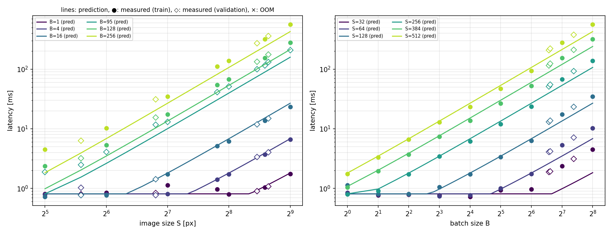
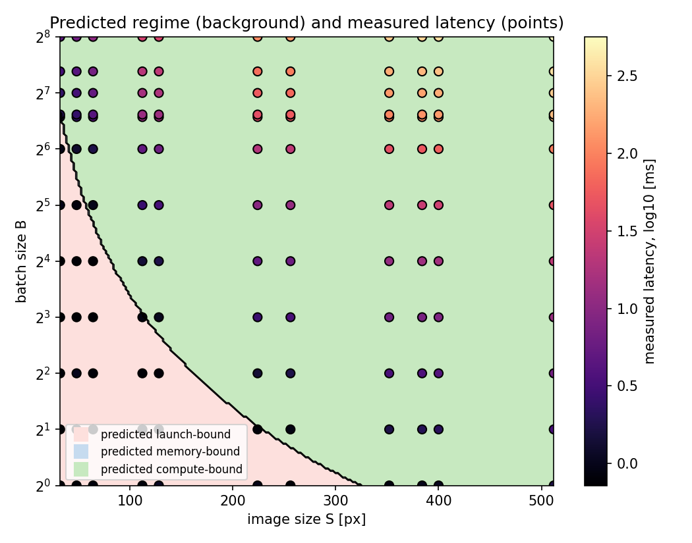
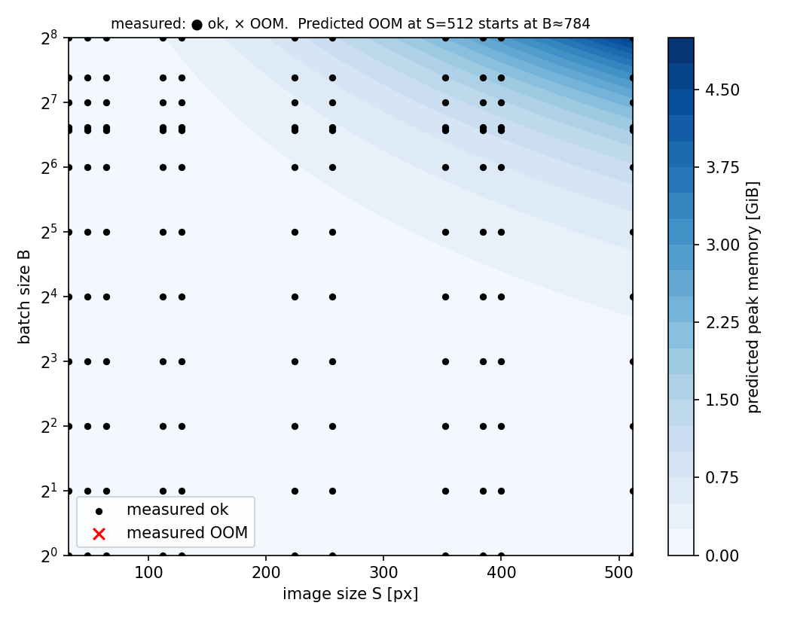
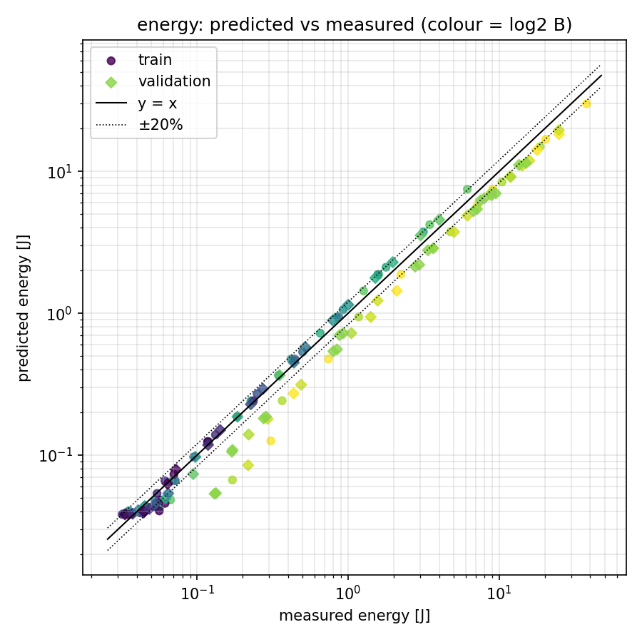

# HW1 — Analytical performance model of a small CNN

## Environment
Filled automatically in `results/meta.json` by `measure.py`. Copy here:

| | |
|---|---|
| GPU | `<e.g. Tesla T4, 15.0 GiB>` |
| Driver / CUDA / cuDNN | `<...>` |
| PyTorch / Python | `<...>` |
| Energy measurement | `<nvml_total_energy_counter / power_sampling_10ms>` |
| Micro-benchmarks | copy BW = `<...> GB/s`, FP32 GEMM = `<...> TFLOP/s` |

## Reproduce (Colab: Runtime → Change runtime type → T4 GPU)
```bash
!git clone <THIS_REPO_URL> && cd <REPO>/hw1
!pip install -q nvidia-ml-py
!python measure.py --quick      # 1-minute smoke test (writes to results/, delete it afterwards)
!rm results/measurements.csv
!python measure.py              # full 11 x 12 grid, ~10-20 min, resumes if interrupted
!python calibrate.py            # -> results/theta.json
!python plots.py                # -> results/figures/*.png
```
`python equations.py` prints the closed-form quantities without a GPU.

## Files
| file | content |
|---|---|
| `equations.py` | architecture spec + `flops`, `memory`, `latency`, `energy` (NumPy, broadcastable) |
| `models.py` | the torch network, built from the same spec |
| `measure.py` | grid, micro-benchmarks, latency / memory / energy / OOM measurements |
| `calibrate.py` | fit of θ on the base grid, errors on train and validation |
| `plots.py` | all figures (measured points + predicted curves/surfaces) |

## Model
Train = base grid (7 × 9); validation = every point with a randomly sampled S or B.

**FLOPs** (1 MAC = 2 FLOPs, BN = 2, ReLU = 1, MaxPool = 8 per output):
`FLOPs(S,B) = 17 793·B·S² + 314 468·B`  (conv part alone: `17 712·B·S²`).
Validated against `torch.utils.flop_counter` (conv + linear only).

**Memory** — peak `max_memory_allocated` under `inference_mode`:
`Mem(S,B) = W + WS_cuBLAS + 12·B·S² + max_l(live_l)`, where only the current input and
output of a layer are alive. Peak is at `bn1`: conv1 output + bn1 output = 64·B·S² bytes, so
`Mem ≈ 12.7 MB + 76·B·S² bytes`.

**Latency** — θ = {P, BW, t_kernel, t_launch}:
`T = max( N_ops·t_launch ,  Σ_l max(F_l/P, M_l/BW) + N_kernels·t_kernel )`,
N_ops = 24, N_kernels = 23. BW is measured by a copy micro-benchmark (every layer cost of this
network scales as B·S², so P and BW are not separable from network data alone); P, t_kernel,
t_launch are fitted by least squares on log-latency.

**Energy**: `E = P_static·T + e_flop·FLOPs + e_byte·Bytes`, non-negative least squares on
relative error.

## Results
<fill from results/theta.json → metrics>

| metric | train MAPE | validation MAPE | max error |
|---|---|---|---|
| memory | | | |
| latency | | | |
| energy | | | |

OOM: measured `<n>`, predicted `<n>`. Fitted θ: `<...>`.






## Discussion (≤ 1 page)
<write after you see the data; points to check are listed in the notes>
